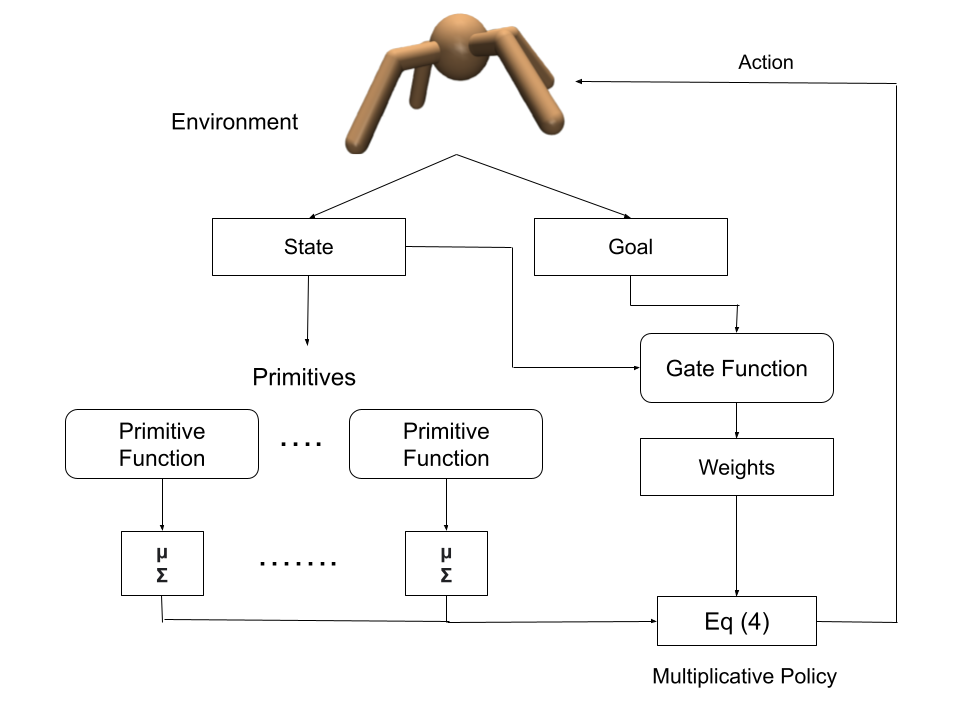

# Multiplicative Compositional Policies

This repo provides implementations of Multiplicative Compositional Policies (MCP), which is a method for learning reusable motor skills that can be composed to produce a range of complex behaviors. All code is written in Python 3, using PyTorch, NumPy, and [Stable-Baselines3](https://stable-baselines3.readthedocs.io). Experiments are simulated with the [MuJoCo Physics Engine](https://mujoco.org/). The project is built on [DRLoco](https://drloco.readthedocs.io), an implementation of [DeepMimic Framework](https://github.com/xbpeng/DeepMimic) with Stable-Baselines3.

---

>  MCP: Learning Composable Hierarchical Control with Multiplicative Compositional Policies. NeurIPS 2019. <br /> 
>  __[[Paper]](https://arxiv.org/abs/1905.09808)__

---

### Experiments Details
The character we decided to work with is a simple degrees-of-freedom (DoFs) ant. Although the paper employs imitative rewards for other characters, it trains the ant by a common RL approach (no imitation). Consequently, we trained the ant in this manner. Additionally, we devised various training methods:
Model Name | Description
------------ | -------------
MCPPO | The paper jointly trained primitives end-to-end, leading to the specializations. In MCPPO, we trained each primitive separately for an individual task. 
MCP Naive | Like the other characters, we incorporate expert demonstrations in the pre-training phase.
<p align="center">

</p>

## Installation
To install requirements, please refer to [DRLoco installation documentation](https://drloco.readthedocs.io/en/latest/main/install.html).

## How to run

#### Initial experiments

```sh
python mcppo.py

python mcp_naive.py
```

#### Experiments from paper

```sh
cd mcp

python train_mcp.py
python train_mcppo.py
python scratch_ant.py

python transfer.py
```

## To generate the trajectories


#### Initial Experiments
```sh

bash gen_plots.sh
bash make_traj.sh
```

#### Experiments from paper
```sh
cd mcp

bash gen_plots.sh
bash make_traj.sh
```
